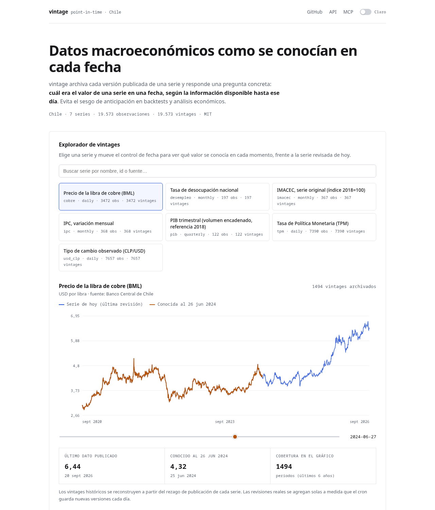

# vintage

**Point-in-time macroeconomic data for Chile — as it was known on each date.**

[](https://github.com/alonsoburon/vintage/actions/workflows/ci.yml)
[](https://vintage-gray-one.vercel.app)
[](./LICENSE)
[](https://modelcontextprotocol.io)

`vintage` archives every published version of a macroeconomic series and answers a
single, precise question:

> **What was the value of series X on day Y, according to what had been published
> up to that day?**

It exposes an open REST API and an MCP server so both humans and AI agents can
query data without look-ahead bias.

- Live demo: https://vintage-gray-one.vercel.app
- MCP endpoint: `https://vintage-gray-one.vercel.app/api/mcp`
- API index: `https://vintage-gray-one.vercel.app/api`

---

## The problem

Macroeconomic data is **revised**. The GDP of a quarter, the monthly CPI or the
IMACEC are published once and then corrected for months. Backtests that use the
latest revision of a series are silently cheating: they use information that did
not exist at the time the decision was made. This is *look-ahead bias*, and it is
everywhere in economics and quant work.

A **vintage** is a snapshot of a series as it was published on a given date. With
vintages you can reproduce exactly what an analyst, a model or a central bank saw
on any historical day.

### A concrete example

The CPI for January 2024 was first published on **5 Feb 2024** with a monthly
change of **0.2%**. Later it was revised and, on **8 Mar 2024**, the same January
print read **0.5%**.

| Query | Returns |
| --- | --- |
| `as_of=2024-02-20` | `0.2` — the only value known that day |
| `as_of=2024-03-20` | `0.5` — the revised value |
| no `as_of` | `0.5` — the latest revision ("the series of today") |

```bash
curl "https://vintage-gray-one.vercel.app/api/series/ipc/observations?as_of=2024-02-20"
```

---

## Series (MVP — Chile)

| id | Series | Frequency | Source |
| --- | --- | --- | --- |
| `pib` | GDP, chained volume (2018 reference) | quarterly | BCCh |
| `ipc` | CPI, monthly change | monthly | INE (via BCCh) |
| `imacec` | Monthly economic activity indicator | monthly | BCCh |
| `tpm` | Monetary policy rate | daily | BCCh |
| `usd_clp` | Observed USD/CLP exchange rate | daily | BCCh |
| `desempleo` | National unemployment rate | monthly | INE (via BCCh) |
| `cobre` | Copper price, USD/lb (LME) | daily | BCCh |

Values come from the **Banco Central de Chile** statistical database (BDE / SIETE)
via its REST API, and from **INE** series republished by the BCCh. See
[Sources and terms](#sources-and-terms).

---

## API

Open and keyless. Base URL: `https://vintage-gray-one.vercel.app`

| Method | Path | Description |
| --- | --- | --- |
| `GET` | `/api` | Machine-readable index of endpoints and limits |
| `GET` | `/api/health` | Service and database health |
| `GET` | `/api/series` | List series. `?q=` searches by id, name or source |
| `GET` | `/api/series/:id` | Metadata plus recent observations |
| `GET` | `/api/series/:id/observations` | Observations (see params below) |
| `GET` | `/api/series/:id/vintages` | Every publication date archived |

### `/api/series/:id/observations`

| Param | Description |
| --- | --- |
| `as_of` | ISO date/timestamp. Returns, for each period, the value published on or before it |
| `from`, `to` | `YYYY-MM-DD` bounds on the reference period |
| `history=true` | Return **every** archived row (all vintages), not just the as-of projection |
| `format` | `json` (default) or `csv` |
| `limit` | Page size, 1–20000 (default 1000; 5000 with `history`) |
| `offset` | Page offset |

```bash
# Current revision
curl "https://vintage-gray-one.vercel.app/api/series/desempleo/observations?from=2024-01-01"

# Exactly what was known on 2025-06-30
curl "https://vintage-gray-one.vercel.app/api/series/imacec/observations?as_of=2025-06-30"

# Full revision history, as CSV
curl "https://vintage-gray-one.vercel.app/api/series/usd_clp/observations?history=true&format=csv"

# Which publication dates exist
curl "https://vintage-gray-one.vercel.app/api/series/ipc/vintages"
```

### Limits

The API is public and unauthenticated, with hard limits so it stays available for
everyone (enforced atomically in Postgres, per IP and globally):

| Limit | Value |
| --- | --- |
| Burst | 60 requests / minute / IP |
| Daily per IP | 2,000 requests / day |
| Daily global | 50,000 requests / day |
| Max page size | 20,000 rows |

Over-limit responses use HTTP `429` with a `Retry-After` header. The counters are
configurable via `RATE_LIMIT_*` environment variables.

---

## MCP

`vintage` ships a [Model Context Protocol](https://modelcontextprotocol.io) server
over streamable HTTP at `/api/mcp`, so agents can use it directly.

Add it to Claude, Cursor or any MCP client:

```json
{
  "mcpServers": {
    "vintage": {
      "url": "https://vintage-gray-one.vercel.app/api/mcp"
    }
  }
}
```

Tools:

| Tool | Arguments | Returns |
| --- | --- | --- |
| `list_series` | — | All archived series with coverage and vintage counts |
| `search_series` | `query`, `limit?` | Series matching a free-text term |
| `get_series` | `series_id` | Metadata and coverage for one series |
| `get_observations` | `series_id`, `as_of?`, `from?`, `to?`, `limit?` | Point-in-time observations |

The `get_observations` tool is the one to use for backtests: passing `as_of`
returns each period exactly as it was known that day.

---

## Web demo

The landing page lets you search series and drag a date slider to compare the
latest revision ("series of today") against the data that was known on any
publication date.



---

## How it works

### Data model

```sql
series(id, name, source, unit, frequency, metadata jsonb)

observations(
  series_id, obs_date, value, published_at, source_url,
  PRIMARY KEY (series_id, obs_date, published_at)
)
```

One row per `(series, reference period, publication timestamp)`. Revisions are
new rows, never overwrites, so history is preserved.

### `as_of` semantics

For every `(series_id, obs_date)`, pick the row with the greatest
`published_at <= as_of`:

```sql
SELECT DISTINCT ON (series_id, obs_date) *
FROM observations
WHERE series_id = $1 AND published_at <= $2
ORDER BY series_id, obs_date, published_at DESC;
```

### Ingestion

A daily Vercel Cron calls `/api/cron/ingest`. Each run:

1. Downloads the current series from BCCh.
2. Compares it with what is archived.
3. Inserts **new** periods (with a reconstructed `published_at` when the source
   does not expose one) and **revisions** (stamped with the ingestion time).
4. Is idempotent: the primary key plus `ON CONFLICT DO UPDATE` means repeated
   runs never duplicate rows.

For historical backfill, `published_at` is reconstructed from each series'
publication lag (e.g. the observed dollar is published the next business day,
quarterly GDP about 48 days after the quarter). These dates are clearly labelled
as reconstructed; real revisions accumulate as the cron runs every day.

---

## Run locally

Requirements: Node 20+, and a Postgres 16+ database (or Docker).

```bash
git clone https://github.com/alonsoburon/vintage.git
cd vintage
npm install

cp .env.example .env.local        # set DATABASE_URL, and BCCH_TOKEN if you have one
docker compose up -d db           # or point DATABASE_URL at any Postgres

npm run db:migrate                # create tables
npm run db:seed                   # register series metadata
npm run db:backfill               # download history (needs BCCH credentials)
npm run dev                       # http://localhost:3000
```

### BCCh credentials

The Banco Central de Chile REST API requires a personal token (free). Request one
at <https://si3.bcentral.cl/> and set `BCCH_TOKEN` (or `BCCH_USER` + `BCCH_PASS`).
Without it, the app falls back to the keyless `mindicador.cl` source for series
that have one; `pib` has no keyless fallback and will be skipped.

### Tests

```bash
npm test          # Vitest: unit + Postgres integration
npm run typecheck
npm run build
```

Integration tests need a database in `TEST_DATABASE_URL`; CI provisions one with
a Postgres service container.

---

## Ingestion & cron

`vercel.json` schedules the daily refresh:

```json
{ "crons": [{ "path": "/api/cron/ingest", "schedule": "0 12 * * *" }] }
```

Vercel sends `Authorization: Bearer $CRON_SECRET`; set `CRON_SECRET` in the
project so the route can verify it. You can also run ingestion yourself:

```bash
npm run db:ingest      # last 90 days (or INGEST_FROM)
npm run db:backfill    # full history (or BACKFILL_FROM)
```

---

## Sources and terms

| Source | Used for | Notes |
| --- | --- | --- |
| [Banco Central de Chile — BDE/SIETE](https://si3.bcentral.cl/) | pib, imacec, tpm, usd_clp, cobre, ipc, desempleo | Free, requires a personal token. Attribute "Banco Central de Chile". |
| [INE](https://www.ine.gob.cl/) | ipc, desempleo | The official producer; BCCh republishes these series. |
| [mindicador.cl](https://mindicador.cl/) | keyless fallback | Aggregates BCCh/INE values. |

This project is **not affiliated** with the BCCh or the INE. Always cite the
original institution and check each source's terms before redistributing raw
data. Each series row exposes its `source` and `source_url` so attribution
travels with the data.

## Data license

The **code and schema** are MIT-licensed. **Data** belongs to its sources and is
provided for reference; if a source forbids redistribution, treat the API as a
convenience layer and pull from the source directly with your own credentials.
Set `BACKFILL_SOURCE`/`BCCH_TOKEN` to source data yourself, or deploy your own
instance against your own database.

---

## Limitations

- **Chile only** (MVP). The architecture is multi-country, but only Chilean
  series are configured.
- **Reconstructed history.** For past periods the BCCh API returns the current
  revision, not the original vintage. Historical `published_at` is approximated
  from publication lags; genuine vintages accumulate from the moment your
  instance starts ingesting. No synthetic revisions are fabricated.
- **BCCh terms.** Redistribution of raw BCCh data may be restricted; see above.
- Rate limits are per serverless instance for the burst window, but the daily
  quotas are shared via Postgres.

## Roadmap

- More LatAm countries (BCRP, BCRA, BanRep, BCB, BCU, …).
- More Chilean series and true vintage reconstruction from archived releases.
- Auth + higher limits for heavy users.
- Arrow/Parquet bulk export.

## Contributing

Issues and PRs welcome. Run `npm run typecheck && npm test` before opening a PR.

## License

[MIT](./LICENSE) © 2026 Alonso Burón.
